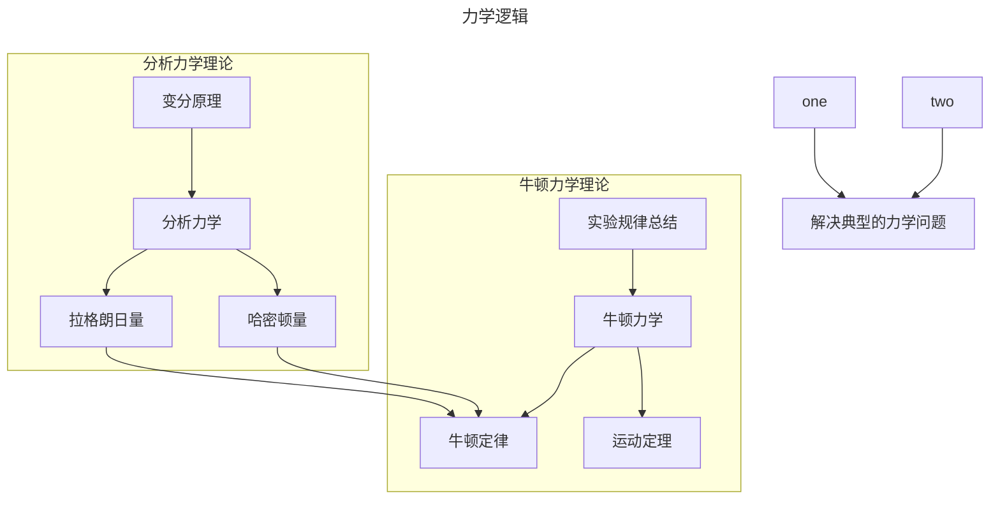

### 力学  

#### 逻辑  



#### 历史（节选）

```timeline
title 力学领域物理学专家
section 阿基米德（Archimedes，公元前287﹣前212）
    简介 : 古希腊哲学家、数学家、物理学家、发明家、工程师、天文学家
    贡献 : 建立静力学平衡定律，最早发现阿基米德浮力定律、滑轮原理和杠杆原理
    著作 : 《浮体》是流体静学的第一部专著，《论平面平衡》-书中建立了静力学平衡的基础
section 伽利略（Galileo Galilei,1564-1642)
    简介 : 意大利天文学家、哲学家、数学家和物理学家
    贡献 : 用自制的望远镜观测到的金星"相位"现象，为"日心说"提供了决定性的实验证据，首个通过人工设计实验及思想推理获得自由落体定律和惯性定律
    著作 : 《关于托勒密和哥白尼的两大世界体系的对话》，《关于力学和运动的两门新科学的对话》创立了运动学和动力学的基本原理和方法
section 牛顿（Isaac Newton,1643-1727)
    简介 : 英国数学家、物理学家和天文学家，经典力学的创建者。
    贡献 : 牛顿运动定律和万有引力定律四个定律奠定了牛顿力学的基础，使力学有了精练完美的表达，成为系统完整的科学
    著作 : 《自然哲学的数学原理》一书阐述了牛顿所研究的重要成果，即牛顿运动定律和万有引力定律
```