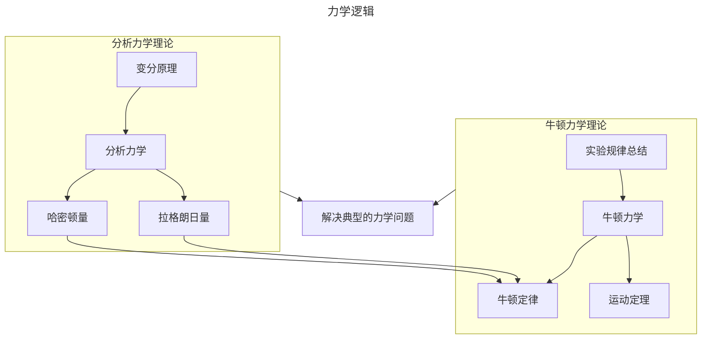
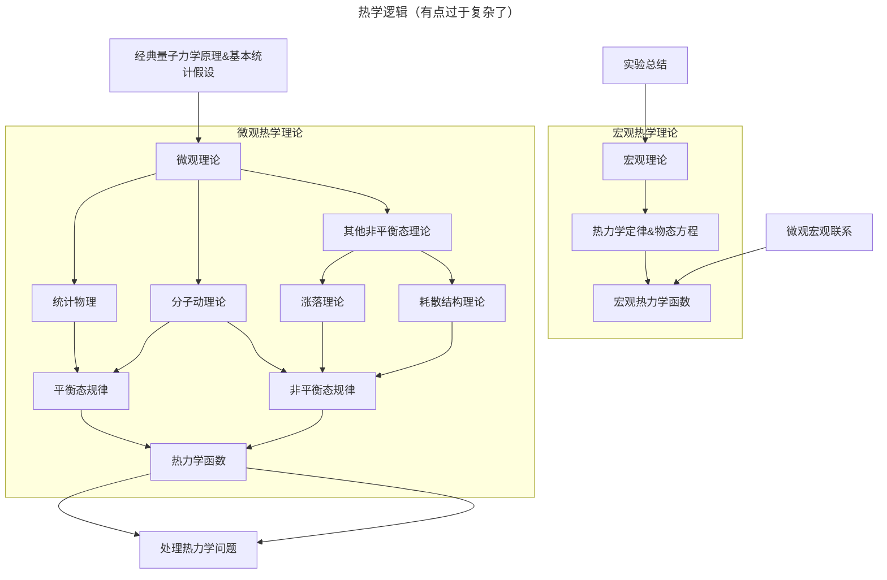
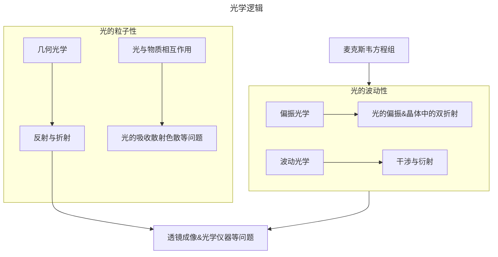
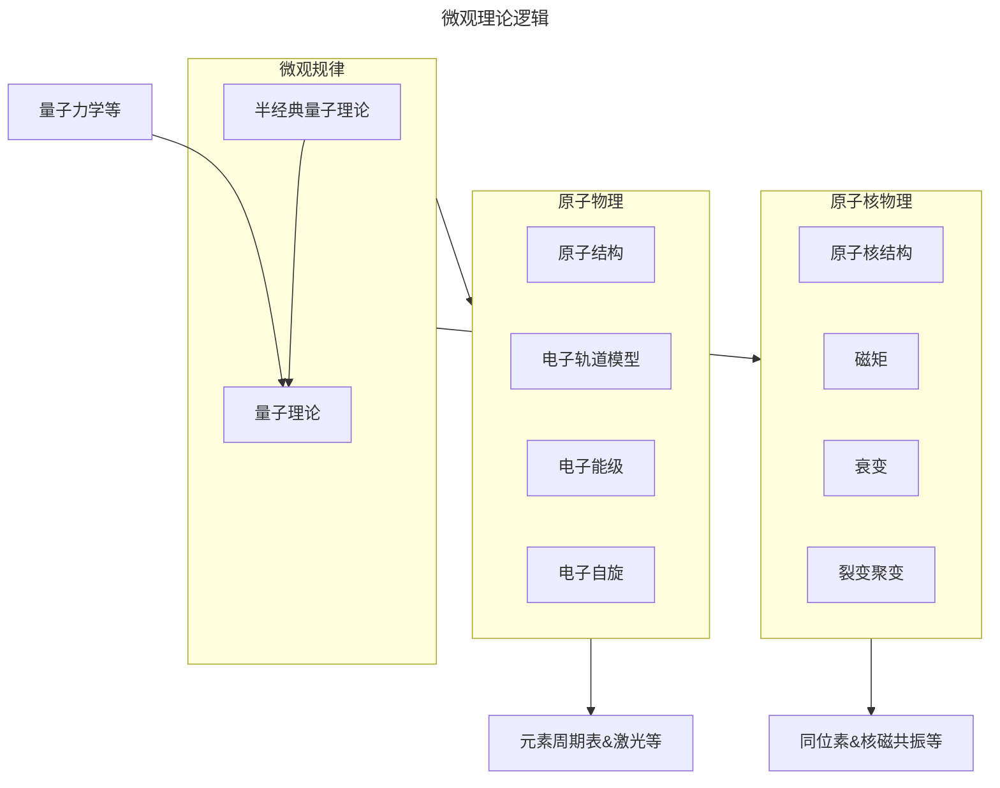

### 力学  

#### 逻辑  



#### 历史（节选）

请先熟读课本

1. 简史
    - 天体观测规律
        > 地心说  
        > 日心说  
        > 开普勒定律  
        > 伽利略验证  
    - 地面实验规律
        > 亚里士多德《物理学》  
        > 伽利略斜面实验  
    - 天地合一理论规律
        > 牛顿万有引力定律，运动定律，《自然哲学的数学原理》  
    - 理论规律的作用
        > 哈雷彗星  
        > 海王星  
    - 理论规律进一步完善
        > 卡文迪许扭秤实验  
        > 拉格朗日《分析力学》  
        > 哈密顿《动力学的一种普遍方法》  
2. 著名物理学家
    - 阿基米德
        > 古希腊  
        > 阿基米德浮力定律  
        > 静力学平衡定律  
        > 滑轮原理杠杆原理  
    - 伽利略
        > 意大利  
        > 验证日心说  
        > 人工设计实验与思想推理获得自由落体定律和惯性定律  
    - 牛顿
        > 英国  
        > 牛顿三定律  
        > 万有引力定律  

#### 应用

简要浏览课本内容  

### 热学

#### 逻辑



#### 历史

请先熟读课本

1. 简史
    - 宏观热力学
        > 玻盖查三定律  
        > 焦耳热力学第一定律  
        > 卡诺定理  
        > 克劳修斯，开尔文热力学第二定律  
        > 能斯特热力学第三定律  
        > 褔勒热力学第零定律  
    - 分子动理论
        > 克劳修斯气体压强  
        > 麦克斯韦速率分布律  
        > 玻尔兹曼分布、H定理  
    - 统计物理学
        > 开尔文，洛喜密脱可逆性佯谬  
        > 玻尔兹曼经典平衡态问题  
        > 普朗克玻尔兹曼常量  
        > 吉布斯系综统计方法  
    - 其他非平衡态理论
        > 朗之万方程  
        > 爱因斯坦-斯莫陆绰斯基理论  
2. 著名物理学家
    - 摄尔修斯
        > 瑞典  
        > 摄氏温标  
        > 水的沸点与大气压的关系  
    - 卡诺
        > 法国  
        > 气体作为工质  
        > 卡诺定理  
    - 焦耳
        > 英国  
        > 热力学第一定律  
        > 热功当量  

#### 应用

简要浏览课本内容

### 电磁学

#### 逻辑

```mermaid
---
title: 电磁学逻辑
---
flowchart TB
    基于实验的理论总结-->电磁理论
    基于实验的理论总结-->电路
    电磁理论-->麦克斯韦方程组
    麦克斯韦方程组-->电磁场
    麦克斯韦方程组-->解决电磁场问题
    麦克斯韦方程组-->预言电磁波
    subgraph 电磁场
    库仑定律
    毕奥-萨伐尔定律
    安培定律
    法拉第电磁感应定律
    end
    基于实验-->电磁场
    电路-->恒定电路
    电路-->交变电路
    恒定电路-->欧姆定律，基尔霍夫方程组
    交变电路-->欧姆定律，基尔霍夫方程组
```

#### 历史

请先熟读课本

1. 简史
    - 静电与静磁
        > 泰勒斯静电吸引与天然磁  
        > 普利斯特静电力距离反比麦克斯韦验证  
        > 库仑定律  
    - 运动的电荷产生磁场
        > 伏打电堆  
        > 奥斯特电流的磁效应  
        > 毕奥-萨伐尔定律 载流长直导线磁效应  
        > 安培定律  
        > 洛伦兹力  
    - 变化的磁场产生电场
        > 法拉第电磁感应定律  
        > 楞次定律  
    - 电磁理论统一
        > 麦克斯韦方程组  
        > 赫兹电磁波  
        > 欧姆定律  
        > 基尔霍夫方程组  
2. 著名物理学家
    - 库仑
       > 法国  
       > 库仑定律  
       > 库仑扭秤  
    - 伏打
       > 意大利  
       > 伏打电堆  
       > 起电盘  
    - 安培
       > 法国  
       > 安培力
       > 分子环流假说
       > 安培环路定理

#### 应用

请熟读课本

### 光学

#### 逻辑



#### 历史

请先熟读课本

1. 简史
    - 几何光学
        > 开普勒全反射  
        > 斯涅耳笛卡尔折射定律  
        > 费马最小时间原理  
        > 罗默光速有限  
    - 波动光学
        > 格里马第光的衍射  
        > 胡克薄膜干涉  
        > 巴塞林纳斯冰洲石双折射  
        > 惠更斯-菲涅尔原理  
    - 量子光学
        > 赫兹光电效应  
        > 普朗克能量量子化  
        > 爱因斯坦光量子  
    - 光的波粒二象性
        > 德布罗意物质波  
        > 戴维逊-革末电子束衍射  
2. 著名物理学家
    - 斯涅耳
        > 荷兰  
        > 折射定律  
    - 费马
        > 法国  
        > 费马原理  
    - 惠更斯
        > 荷兰  
        > 惠更斯原理  
        > 土卫六  

#### 应用

请熟读课本

### 微观理论

#### 逻辑


