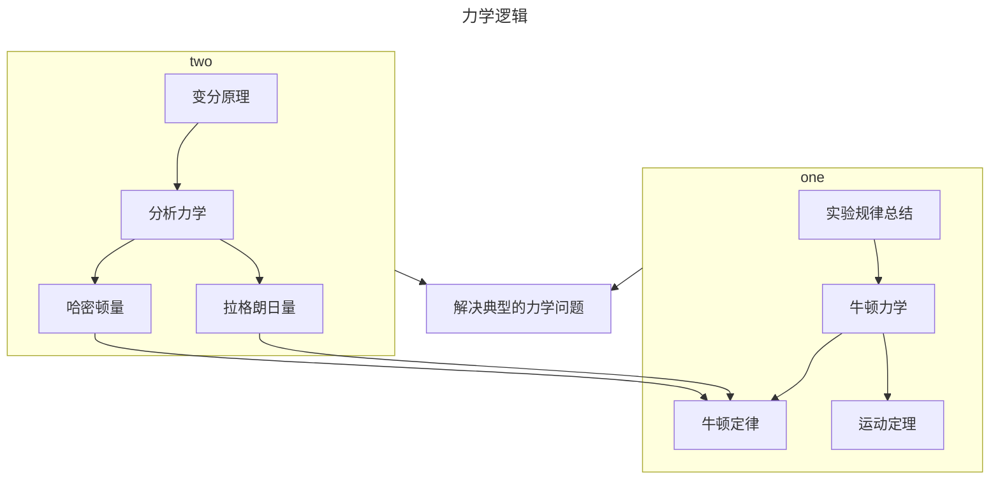

### 力学  

#### 逻辑  

```mermaid
---
title: 力学逻辑
---
flowchart TB
    subgraph one
    实验规律总结-->牛顿力学
    牛顿力学-->牛顿定律
    牛顿力学-->运动定理
    end
    subgraph two
    变分原理-->分析力学
    分析力学-->拉格朗日量
    分析力学-->哈密顿量
    end
    拉格朗日量-->牛顿定律
    哈密顿量-->牛顿定律
    one --> 解决典型的力学问题
    two --> 解决典型的力学问题
```

#### 历史（节选）
