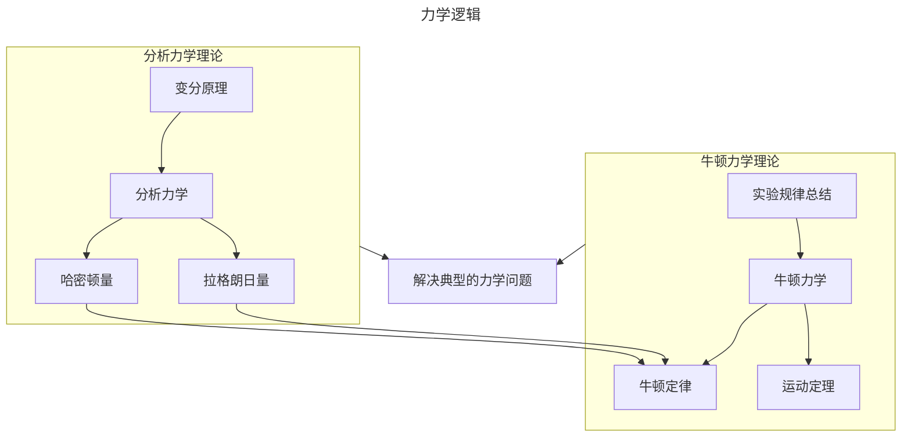

### 力学  

#### 逻辑  



#### 历史（节选）

请先熟读课本

1. 简史
    - 天体观测规律
        > 地心说
        > 日心说
        > 开普勒定律
        > 伽利略验证
    - 地面实验规律
        > 亚里士多德《物理学》
        > 伽利略斜面实验
    - 天地合一理论规律
        > 牛顿万有引力定律，运动定律，《自然哲学的数学原理》
    - 理论规律的作用
        > 哈雷彗星
        > 海王星
    - 理论规律进一步完善
        > 卡文迪许扭秤实验
        > 拉格朗日《分析力学》
        > 哈密顿《动力学的一种普遍方法》
2. 著名物理学家
    - 阿基米德
        > 古希腊
        > 阿基米德浮力定律
        > 静力学平衡定律
        > 滑轮原理杠杆原理
    - 伽利略
        > 意大利
        > 验证日心说
        > 人工设计实验与思想推理获得自由落体定律和惯性定律
    - 牛顿
        > 英国
        > 牛顿三定律
        > 万有引力定律

#### 应用

简要浏览课本内容  

### 热学

#### 逻辑

```mermaid
---
title: 热学逻辑（有点过于复杂了）
---
flowchart TB
    subgraph 宏观热学理论
    宏观理论-->热力学定律，物态方程
    热力学定律，物态方程-->宏观热力学函数
    end
    实验总结-->宏观理论
    热力学函数-->处理热力学问题
    微观宏观联系-->宏观热力学函数
    subgraph 微观热学理论
    微观理论-->统计物理
    统计物理-->平衡态规律
    平衡态规律-->热力学函数
    微观理论-->分子动理论
    分子动理论-->平衡态规律
    分子动理论-->非平衡态规律
    微观理论-->其他非平衡态理论
    其他非平衡态理论-->涨落理论
    其他非平衡态理论-->耗散结构理论
    涨落理论-->非平衡态规律
    耗散结构理论-->非平衡态规律
    非平衡态规律-->热力学函数
    end
    经典量子力学原理，基本统计假设-->微观理论
    热力学函数-->处理热力学问题
```

#### 历史

请先熟读课本

1. 简史
    - 宏观热力学
        > 玻盖查三定律
        > 焦耳热力学第一定律
        > 卡诺定理
        > 克劳修斯，开尔文热力学第二定律
        > 能斯特热力学第三定律
        > 褔勒热力学第零定律
    - 分子动理论
        > 克劳修斯气体压强
        > 麦克斯韦速率分布律
        > 玻尔兹曼分布、H定理
    - 统计物理学
        > 开尔文，洛喜密脱可逆性佯谬
        > 玻尔兹曼经典平衡态问题
        > 普朗克玻尔兹曼常量
        > 吉布斯系综统计方法
    - 其他非平衡态理论
        > 朗之万方程
        > 爱因斯坦-斯莫陆绰斯基理论
2. 著名物理学家
    - 摄尔修斯
        > 瑞典
        > 摄氏温标
        > 水的沸点与大气压的关系
    - 卡诺
        > 法国
        > 气体作为工质
        > 卡诺定理
    - 焦耳
        > 英国
        > 热力学第一定律
        > 热功当量

#### 应用

简要浏览课本内容

### 电磁学

#### 逻辑

```mermaid
---
title: 电磁学逻辑
---
flowchart TB
    基于实验的理论-->电磁理论
    基于实验的理论-->电路
    电磁理论-->麦克斯韦方程组
    麦克斯韦方程组-->电磁场
    麦克斯韦方程组-->解决电磁场问题
    麦克斯韦方程组-->预言电磁波
    subgraph 电磁场
    库仑定律-->电磁荷产生的电磁场
    毕奥-萨伐尔定律，安培定律-->运动的电荷产生的磁场规律
    法拉第电磁感应定律-->变化的磁场产生的电场规律
    电磁波辐射规律
    电磁波传播规律
    end
    电磁场-->麦克斯韦方程组的内容
    subgraph 求解
    标势求解-->电磁荷产生的电磁场
    矢势求解-->运动的电荷产生的磁场规律
    矢势求解-->变化的磁场产生的电场规律
    标势与矢势联合求解-->电磁波辐射规律
    波动方程-->电磁波传播规律
    end
    求解方程组-->求解
    电路-->恒定电路
    电路-->交变电路
    恒定电路-->欧姆定律，基尔霍夫方程组
    交变电路-->欧姆定律，基尔霍夫方程组
```