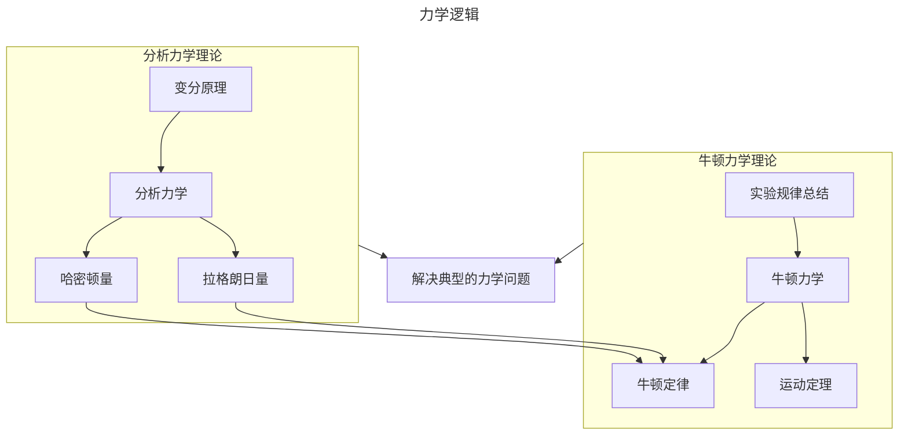
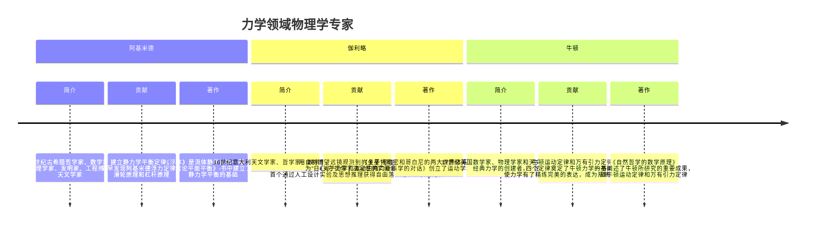
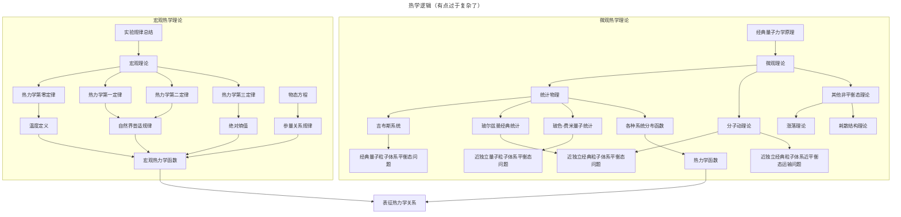
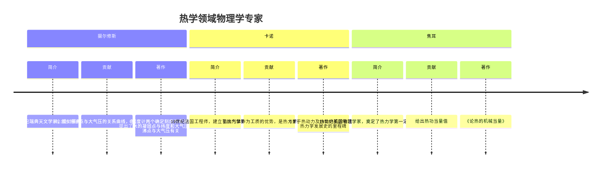

### 力学  

#### 逻辑  



#### 历史（节选）

简要浏览课本内容



#### 应用

简要浏览课本内容  

### 热学

#### 逻辑



#### 历史

简要浏览课本内容



#### 应用

简要浏览课本内容

### 电磁学

#### 逻辑

```mermaid
---
title: 电磁学逻辑
---
flowchart TB
    基于实验的理论-->电磁学
    基于实验的理论-->电路
    电磁学理论-->麦克斯韦方程组
    麦克斯韦方程组-->电磁场
    麦克斯韦方程组-->求解方程组
    subgraph 意义
    电磁荷产生的电磁场
    运动的电荷产生的磁场规律
    变化的磁场产生的电场规律
    end
    洛伦兹力-->电磁荷产生的电磁场
    subgraph 麦克斯韦方程组内容
    库仑定律-->电磁荷产生的电磁场
    毕奥-萨伐尔定律，安培定律-->运动的电荷产生的磁场规律
    法拉第电磁感应定律-->变化的磁场产生的电场规律
    电磁波辐射规律
    电磁波传播规律
    end
    电磁场-->麦克斯韦方程组的内容
    subgraph 求解
    标势求解-->电磁荷产生的电磁场
    矢势求解-->运动的电荷产生的磁场规律
    矢势求解-->变化的磁场产生的电场规律
    标势与矢势联合求解-->电磁波辐射规律
    波动方程-->电磁波传播规律
    end
    求解方程组-->求解
    电路-->恒定电路
    电路-->交变电路
    恒定电路-->欧姆定律，基尔霍夫方程组
    交变电路-->欧姆定律，基尔霍夫方程组
```